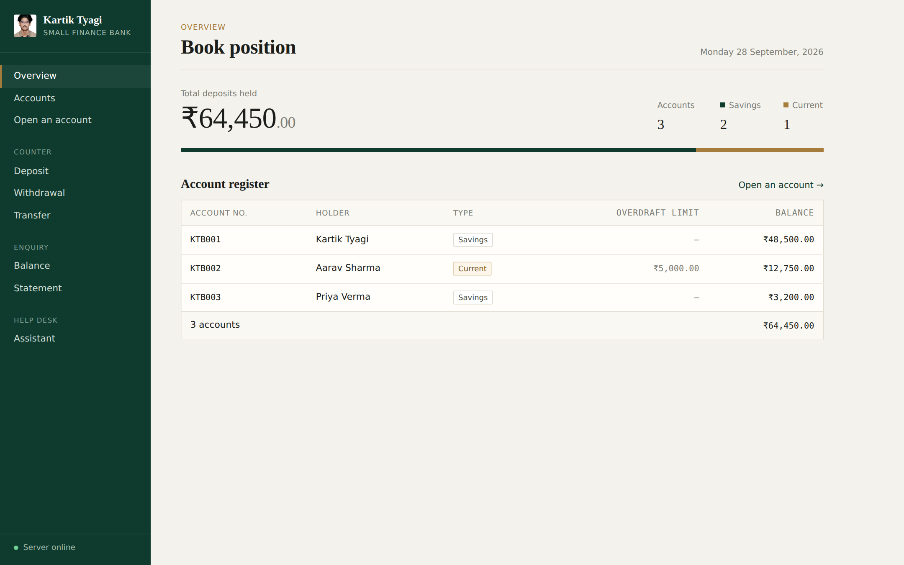
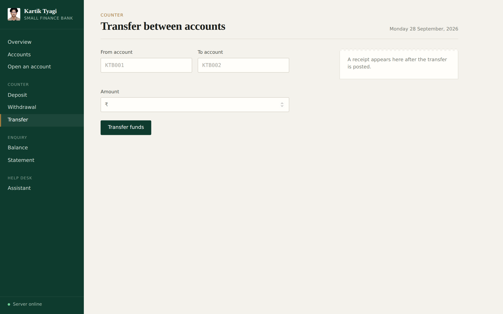
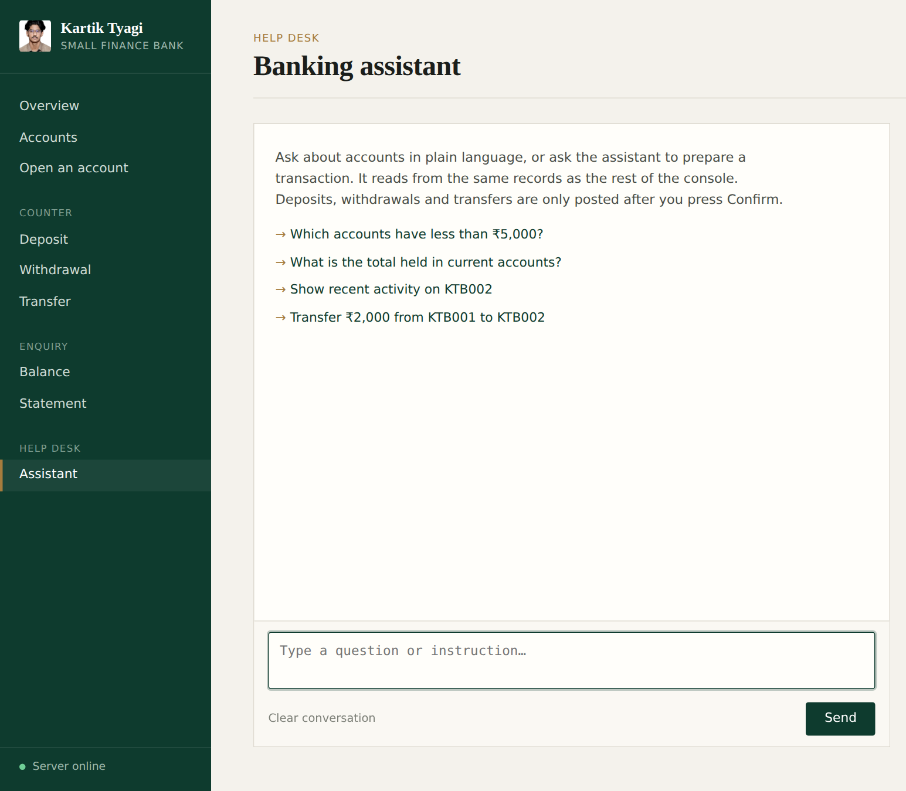

<p align="center">
  
</p>

<h1 align="center">🏦 Bank Management System</h1>

<p align="center">
  <b>Kartik Tyagi Small Finance Bank</b> — a Java banking app with a web UI and a Generative AI banking assistant
</p>

<p align="center">
  
  
  
  
  
  
</p>

<p align="center">
  Built entirely with core Java — no frameworks, no external libraries — to show OOP, Collections, File I/O and REST API design from the ground up.
</p>

---

## ✨ Features

| | Feature |
|---|---|
| 🧾 | Create **Savings** and **Current** accounts |
| 💰 | **Deposit**, **withdraw** and **transfer** funds between accounts |
| 🛡️ | Insufficient-funds protection via a custom exception |
| 💳 | **Overdraft** support on Current accounts |
| 📜 | Full **transaction history** per account |
| 💾 | **Persistent storage** with File I/O — data survives restarts |
| 🌐 | **Web UI** served by a lightweight Java HTTP server |
| 🤖 | **GenAI banking assistant** — ask questions and prepare transactions in plain English |
| 🖥️ | Classic **console menu** version included |

---

## 📸 Screenshots

<p align="center">
  
  <br/><sub><b>Overview</b> — total deposits and the account register</sub>
</p>

<table>
  <tr>
    <td width="50%"><p align="center"><sub><b>Transfer</b> between accounts</sub></p></td>
    <td width="50%"><p align="center"><sub><b>AI Banking Assistant</b></sub></p></td>
  </tr>
</table>

---

## 🏗️ Architecture

```
 ┌──────────────────────────┐        ┌──────────────────────────┐
 │  Web UI                  │        │  Console App             │
 │  index.html · app.js     │        │  BankApp.java            │
 └────────────┬─────────────┘        └────────────┬─────────────┘
              │ REST (JSON)                        │
              ▼                                    │
 ┌──────────────────────────┐                      │
 │  BankServer.java         │──▶ AssistantService ─┼──▶ LLM API (Groq / Gemini /
 │  /api/* endpoints        │    (tool calling)    │      OpenRouter / Ollama)
 └────────────┬─────────────┘                      │
              ▼                                    ▼
 ┌─────────────────────────────────────────────────────────────┐
 │  Bank.java — HashMap<String, Account> + File I/O            │
 └────────────────────────────┬────────────────────────────────┘
                              ▼
                        accounts.txt
```

Both the web UI and the console app share the same `Bank` class and `accounts.txt`.

---

## 🤖 Generative AI Banking Assistant

Staff can ask things like:

> *"Which accounts have less than ₹5,000?"*
> *"Transfer ₹2,000 from KTB001 to KTB002"*

**How it works**

- The browser sends the message to `POST /api/assistant`. The **API key stays on the server** and never reaches the browser.
- `AssistantService` calls an OpenAI-compatible chat-completions API using **tool (function) calling**. The model gets four tools — `list_accounts`, `get_account`, `get_statement`, `propose_transaction` — so every figure comes from `Bank`, not from the model guessing.
- `propose_transaction` **never moves money on its own.** It returns a confirmation card, and the transaction only runs through the normal `/api/deposit`, `/api/withdraw` or `/api/transfer` routes when a person clicks **Confirm**.
- `Json.java` is a small hand-written JSON reader/writer, so the project needs **zero external libraries**.

---

## 🧠 OOP Concepts Used

| Concept | Where |
|---|---|
| **Encapsulation** | Private fields with getters in `Account` and `Customer` |
| **Inheritance** | `SavingsAccount` and `CurrentAccount` extend `Account` |
| **Polymorphism** | `CurrentAccount` overrides `withdraw()` to allow overdraft |
| **Abstraction** | `Account` is abstract; subclasses implement `getAccountType()` |
| **Exception Handling** | Custom `InsufficientFundsException` |
| **Collections** | `HashMap<String, Account>` for O(1) lookup, `ArrayList` for history |
| **File I/O** | `BufferedReader` / `BufferedWriter` for persistence |

```java
@Override
public void withdraw(double amount) throws InsufficientFundsException {
    if (amount > getBalance() + overdraftLimit) {
        throw new InsufficientFundsException(
            "Exceeds overdraft limit! Max available: Rs." + (getBalance() + overdraftLimit));
    }
    // ...
}
```

---

## 📁 Project Structure

```
BankManagementSystem/
├── BankServer.java                  # HTTP server + REST API for the web UI
├── BankApp.java                     # Console menu version
├── Bank.java                        # Core logic — HashMap + File I/O
├── Account.java                     # Abstract base class
├── SavingsAccount.java              # Extends Account
├── CurrentAccount.java              # Extends Account — overdraft
├── Customer.java                    # Customer entity
├── InsufficientFundsException.java  # Custom exception
├── AssistantService.java            # GenAI assistant — LLM tool calling
├── Json.java                        # Minimal JSON parser/writer
├── index.html                       # Web UI
├── css/style.css
├── js/app.js
├── assets/bank-logo.jpg
└── accounts.txt                     # Auto-generated data file
```

---

## 🔌 REST API

| Method | Endpoint | Description |
|:---:|---|---|
|  | `/api/accounts` | List all accounts |
|  | `/api/account` | Get one account |
|  | `/api/accounts/savings` | Open a savings account |
|  | `/api/accounts/current` | Open a current account |
|  | `/api/deposit` | Deposit money |
|  | `/api/withdraw` | Withdraw money |
|  | `/api/transfer` | Transfer between accounts |
|  | `/api/assistant` | Chat with the AI assistant |
|  | `/api/assistant/status` | Check if the assistant is configured |

---

## 🚀 Getting Started

### Prerequisites

- Java JDK 8 or above

### Run the web app

```bash
git clone https://github.com/kartik-tyagi-tech/BankManagementSystem.git
cd BankManagementSystem
javac *.java
java BankServer
```

Open **http://localhost:8080** in your browser.

### Run the console app

```bash
javac *.java
java BankApp
```

### Enable the AI assistant (free)

1. Get a free API key from [Groq](https://console.groq.com/keys) — no card needed.
2. Create a file named `ai.properties` in the project folder:
   ```properties
   AI_API_KEY=your_groq_key_here
   # Optional overrides:
   # AI_BASE_URL=https://api.groq.com/openai/v1
   # AI_MODEL=openai/gpt-oss-20b
   ```
3. Restart `java BankServer`. The console prints which provider and model the assistant is using.

`ai.properties` is in `.gitignore`, so your key is never committed. Any OpenAI-compatible provider works — Google Gemini, OpenRouter, or a local [Ollama](https://ollama.com) model (fully offline, no key) — just change `AI_BASE_URL` and `AI_MODEL`. You can also set these as environment variables, which take priority over the file.

---

## 💻 Console Preview

```
========================================
       BANK MANAGEMENT SYSTEM
========================================
1. Create Account
2. Deposit Money
3. Withdraw Money
4. Fund Transfer
5. Check Balance
6. Transaction History
7. View All Accounts
8. Exit
```

```
--- Transaction History for KTB001 ---
  > Account created with balance: Rs.5000.0
  > Deposited: Rs.2000.0 | Balance: Rs.7000.0
  > Withdrawn: Rs.1000.0 | Balance: Rs.6000.0
```

---

## 🛣️ Roadmap

- [ ] Move storage from text file to MySQL
- [ ] Rebuild the backend with Spring Boot
- [ ] Login and role-based access for staff
- [ ] Unit tests with JUnit

---

## 👨‍💻 Author

**Kartik Tyagi** — MCA @ VIT Vellore

<p>
  <a href="https://github.com/kartik-tyagi-tech"></a>
  <a href="https://linkedin.com/in/tyagikartik"></a>
  <a href="https://leetcode.com/u/Kartiktyagi16"></a>
</p>

<p align="center">⭐ If you found this useful, consider giving it a star!</p>
